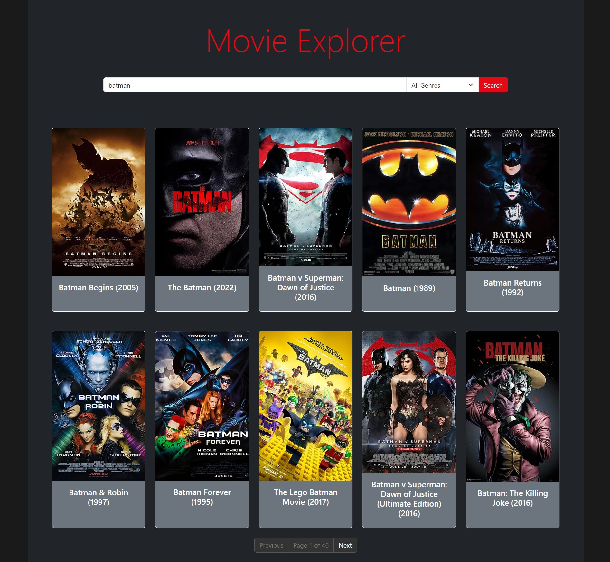
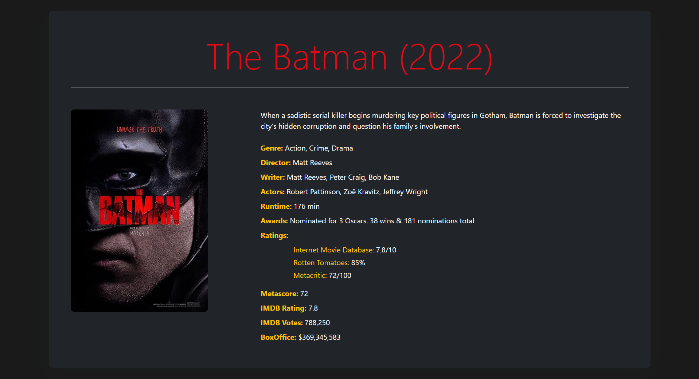

# Movie Explorer

## Description

The Movie Explorer application was developed using a client-server architecture. The server-side was implemented using Node.js with Express.js framework, while the client-side was developed using React.js library.

## Preview

### Home Page


### Movie Details Page


## Live Demo

You can check out the live demo of the Movie Explorer app at: [Movie Explorer App](https://tinyurl.com/Movie-Explorer-App)

## Technologies Used

- **Frontend:**
  - React.js
  - React Router
  - Axios (for making HTTP requests)
  - Bootstrap (for styling)

- **Backend:**
  - Node.js
  - Express.js
  - Axios (for making HTTP requests)
  - CORS (for handling Cross-Origin Resource Sharing)

## Assumptions

- The backend code is designed to fetch movie data from the OMDb API.
- The frontend code is a React application responsible for displaying movie search results and movie details.
- The application allows users to search for movies by title and filter them by genre.
- Pagination is implemented on the frontend to navigate through multiple pages of search results.
- The backend and frontend are deployed separately, with the backend hosted on Render.com as a service and the frontend deployed as a static site also on Render.com.
- The backend requires an OMDb API key, which needs to be stored in a .env file.
- The frontend allows users to view movie details by clicking on a movie poster.
- Both the backend and frontend use Axios for making HTTP requests.
- The frontend uses React Router for navigation between pages.

## Development Process

### Backend Development

1. Set up an Express.js server to handle API requests.
2. Utilized Axios to make requests to the OMDb API.
3. Implemented two endpoints: one for fetching a list of movies based on search criteria and another for fetching detailed information about a specific movie.
4. Implemented pagination logic to handle fetching multiple pages of search results.
5. Filtered movies based on genre if specified in the query parameters.
6. Created environment variables for storing sensitive information such as the OMDb API key.
7. Enabled CORS to allow requests from the frontend.

### Frontend Development

1. Developed a React application using functional components and hooks.
2. Utilized React Router for navigation between the home page and movie details page.
3. Implemented a search feature allowing users to search for movies by title and filter by genre.
4. Displayed search results in a responsive grid layout, with movie posters clickable to view more details.
5. Implemented pagination to navigate through multiple pages of search results.
6. Utilized Axios for making requests to the backend API.
7. Stored search query, selected genre, and fetched movie data in local storage to maintain state across page reloads.
8. Designed loading spinners to indicate when data is being fetched.

### Deployment

1. Deployed the backend server as a service on Render.com.
2. Built the frontend React app for production and deployed it as a static site on Render.com.
3. Ensured environment variables are properly configured in the backend deployment.
4. Configured routing to ensure proper navigation between routes in the deployed React app.
5. Verified that the deployed application functions correctly by testing the live demo link.

## Getting Started

### Prerequisites

- Node.js and npm installed on your machine
- OMDb API key (obtain it from https://www.omdbapi.com/apikey.aspx)

### Installation

1. Clone the repository:

   ```bash
   git clone https://github.com/your-username/movie-explorer.git

2. Navigate to the project directory:
   ```bash
   cd movie-explorer

3. Install the dependencies for the backend:
   ```bash
   cd backend
   npm install

4. Create a .env file in the backend directory and add your OMDb API key:
   ```env
   API_KEY=your-omdb-api-key

5. Install the dependencies for the frontend:
   ```bash
   cd ../frontend
   npm install

### Running the Application

1. Start the backend server:
   ```bashcd
   ../backend
   npm start
   
The server will start running at http://localhost:5000.

2. In a separate terminal, start the frontend development server:
   ```bash
   cd ../frontend
   npm start
   
The React app will open in your default browser at http://localhost:3000.

### Deployment
#### Backend

1. Build the backend server:
   ```bash
   cd backend
   npm install

#### Frontend

1. Build the React app for production:
   ```bash
   cd frontend
   npm run build
